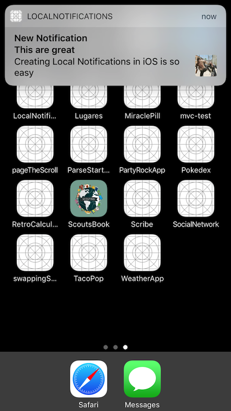
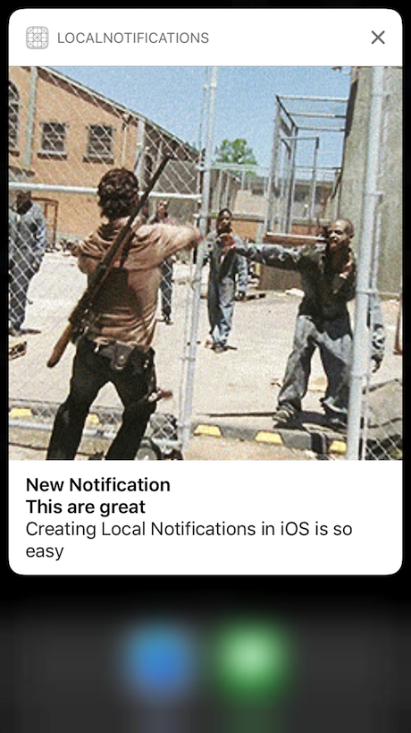

# LocalNotifications

Source : iOS 10 & Swift 3: From Beginner to Paid Professional (Udemy)

LocalNotifications is a project used for swift practice and autoLearning

LocalNotifications App is an app that shows you how to send local notifications within your app

This project uses:

* UserNotifications
* escaping closures

